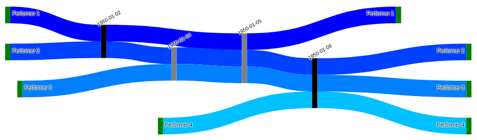

# Introduction
The [‘Interactive Flow of Katherine Dunham’s Dancers, Drummers, and Singers: “Check-Ins” 1947-60’](https://dunhamsdata.org/portfolio/visualizations/interactive-flow-katherine-dunhams-dancers-drummers-and-singers-check-ins) is a web-based solution to visualize the Check-Ins Dataset (available from NADAC). The sankey diagram makes it possible to interactively examine the connections among the 189 dancers, drummers, and singers in choreographer Katherine Dunham’s employ between 1947 and 1960. Seeing who shared space and time together allows us to have a sense of the transmission of embodied knowledge across dozens of performers. Performers are shaded by the first time they appear in the data, from dark blue for the earliest performers to light blue for those who joined the company later on, while vertical bars represent “check-ins,” with black signifying where performer data is comprehensive, meaning all performers are represented, and gray where data is partial.

This interactive tool has two major parts: a sankey diagram and a magnifying window. The creation of the diagram is the focus of this document; for more information on how the magnifier helped us deal with size and visual limitations for enhanced usability and a satisfactory user experience, read this [blog post](https://dunhamsdata.org/personnel-interactivity-usability) of mine.

A sankey diagram is a type of flow chart mainly composed of two types of elements, nodes and links, where the width of a link is proportional to its stream quantity, and the nodes are arranged so that the number of crossings between links is minimized. A key initial decision was to choose how these components will render the data. For that, we needed to clearly identify the problem and what the solution would be like. Our problem is how to represent personnel circulating through Dunham’s company. The proposed solution is based on the idea of the “check-in” to describe patterns of performers coming in and out of the company. For more information on the development of these ideas and how sankey diagrams intuitively arose as the most natural solution for us, read this [blog post](https://dunhamsdata.org/blog/checking-in-the-flows-of-dunhams-performers) by Kate Elswit and Harmony Bench.

With the above solution in mind, I adapted a regular sankey diagram to our case study so that each link corresponds to the trajectory of a performer and always the same performer all along. Every link is 1-unit wide and connects a pair of outer nodes (two nodes per performer—one on the left side when joining the company and one on the right when leaving) through several inner nodes (check-ins). Regarding interaction, the user can hover over nodes and links for check-in date and location information, and to highlight performers and their trajectories, among others. These sets of elements and interactive actions make this flow diagram a tool to track performers in Dunham’s company, contrast their trajectories, study in- and out-flow patterns, and understand their connections through company repertory.

The process of creating the sankey diagram has two key steps: data wrangling and web-based visualization. First, the information is extracted from the Personnel Check-ins Dataset and then transformed to feed the sankey algorithm. Second, a web interface is designed to visualize the data in the form of a flow diagram. The data required for every type of element is:
- For nodes: label (performer’s name or check-in’s date), color (green for performers, black for comprehensive check-ins, and gray for partial check-ins), node type (performer or check-in), and an implicit position within the list of nodes. This order is important because links reference the nodes they connect by this index.
- For links: source node (implicit index), target node (implicit index), width (always 1), label (performer’s name), and color (in this particular case study, a shade of blue).

# Preparing the data
Check-Ins Data is the source dataset that contains all the necessary information for nodes and links.[^links] It is stored on Google Sheets, however, a local copy is downloaded for its analysis. I chose Python and, more specifically, Pandas for my data processing because it makes managing tabular data very simple. I wrote my scripts in Jupyter Notebooks for its ease of creating and sharing my codes and results. The notebooks with the source code and the data can be found on [GitHub](https://github.com/DunhamsData/SankeyDiagram).

[^links]: For detailed information on this dataset, refer to the [“Dunham's Data Personnel Check-In Dataset User Guide”](https://www.dunhamsdata.org/sites/default/files/2023-04/38544-DunhamsDataPersonnelCheckinUserGuide.pdf).

I started the data preparation by filtering empty rows and keeping those where there is a check-in. The next step depends on the context. In the simplest case, check-ins will be indicated by just a ‘y’ (‘yes’) for presence or a ‘n’ (‘no’) for absence (Table 1). In Dunham’s Data project, though, we also have ‘y*’ (interpreted as a ‘y’), ‘?’ (interpreted as a ‘n’), and blanks (see notebook [01](https://github.com/DunhamsData/SankeyDiagram/blob/master/01-personnel_checkins_data.ipynb), cell [15]). To interpret the blanks, it is necessary to make a distinction between comprehensive and non-comprehensive (or partial) check-ins: in comprehensive check-ins, every blank is a ‘no’; in non-comprehensive check-ins, every blank inherits its value from the previous row, regardless the type of check-in of that row ([01](https://github.com/DunhamsData/SankeyDiagram/blob/master/01-personnel_checkins_data.ipynb) [19]). The following made-up tables exemplify this preliminary data transformation (italic values in Table 2 are inferred):

<div align="center">
  
|#|Date      |Comprehensive?|Performer 1|Performer 2|Performer 3|Performer 4|
|-|----------|--------------|-----------|-----------|-----------|-----------|
|0|1950-01-01|              |           |           |           |           |
|1|1950-01-02|True          |y          |y          |           |           |
|2|1950-01-03|              |           |           |           |           |
|3|1950-01-04|False         |n          |           |y          |           |
|4|1950-01-05|False         |y          |           |           |           |
|5|1950-01-06|True          |           |y          |y          |y          |

<div><i>Table 1. Original Check-Ins Dataset</i></div>
<br>
<div>&dArr;</div>
<br>
  
|#|Date      |Comprehensive?|Performer 1|Performer 2|Performer 3|Performer 4|
|-|----------|--------------|-----------|-----------|-----------|-----------|
|1|1950-01-02|True          |y          |y          |*n*        |*n*        |
|3|1950-01-04|False         |n          |*y*        |y          |*n*        |
|4|1950-01-05|False         |y          |*y*        |*y*        |*n*        |
|5|1950-01-06|True          |*n*        |y          |y          |y          |

<div><i>Table 2. Transformed Check-Ins Dataset</i></div>
</div>
<br>

Table 2 is the base for building the node and link datasets. Let us start with the nodes. Given the previous table, for every performer in the header, I added a row that will be the second node for that performer. It is important to label these rows differently from the column headers to ensure that a performer's left node and right node are different in the diagram—I added a “\_2” to every performer’s name in this regard ([05](https://github.com/DunhamsData/SankeyDiagram/blob/master/05-sankey.ipynb) [22]). Notice that the new rows will be used as the “last check-in” of the performers, so all the values for each row will be a “n” for every column except for the matching column, whose value will be a “y” ([05](https://github.com/DunhamsData/SankeyDiagram/blob/master/05-sankey.ipynb) [23]). The following table continues the previous example and includes the new data (italic values show the matching names):

<div align="center">

|#|Date          |Performer 1|Performer 2|Performer 3|Performer 4|
|-|--------------|-----------|-----------|-----------|-----------|
|0|1950-01-02    |y          |y          |n          |n          |
|1|1950-01-04    |n          |y          |y          |n          |
|2|1950-01-05    |y          |y          |y          |n          |
|3|1950-01-06    |n          |y          |y          |y          |
|4|Performer 1 _2|*y*        |n          |n          |n          |
|5|Performer 2 _2|n          |*y*        |n          |n          |
|6|Performer 3 _2|n          |n          |*y*        |n          |
|7|Performer 4 _2|n          |n          |n          |*y*        |

<div><i>Table 3. Extended Check-Ins Dataset</i></div>
</div>
<br>

Next, I created a node table that contains, among other information, a name or identifier of each node, a label to display on the flow diagram, the node color (green for performers, black for comprehensive check-ins, and gray for partial check-ins), and the node type (performer or check-in). The node type is stored on an attribute, not originally included in the Plotly.js library. To learn more about how I created this special attribute, read my [“Contributions to Plotly.js library for a bespoke Sankey diagram”](https://github.com/DunhamsData/SankeyDiagram/blob/master/docs/ContributionsPlotlyBespokeSankeyDiagram.pdf). The way I built this table is as follows ([05](https://github.com/DunhamsData/SankeyDiagram/blob/master/05-sankey.ipynb) [32]):

```
Input: Extended Check-Ins DataFrame (e.g., Table 3)
Output: Node DataFrame (e.g., Table 4)
1   df ← empty DataFrame
2   for each column in input DataFrame (e.g., Performer 1, Performer 2, …), do
3       name ← column header
4       label ← column header
5       color ← ‘green’
6       type ← ‘performer’
7       add row < name, label, color, type > to df
8   end
9   for each date type row in input Data DataFrame (e.g., rows 0 - 3), do
10      name ← row date
11      label ← row date
12      color ← ‘black’ if comprehensive check-in
13      color ← ‘gray’ if non-comprehensive check-in
14      type ← ‘check-in’
15      add row < name, label, color, type > to df
16  end
17  for each performer type row in input Data DataFrame (e.g., rows 4 - 7), do
18      name ← row performer name (including ‘_2’)
19      label ← row performer name (excluding (‘_2’)
20      color ← ‘green’
21      type ← ‘performer’
22      add row < name, label, color, type > to df
23  end
```

<div align="center"><i>Algorithm 1. Algorithm to create Node Dataset</i></div>
<br>

Continuing with the previous example, the result of this process would be:

<div align="center">

|# |Name          |Label      |Color|Type     |
|--|--------------|-----------|-----|---------|
|0 |Performer 1   |Performer 1|green|performer|
|1 |Performer 2   |Performer 2|green|performer|
|2 |Performer 3   |Performer 3|green|performer|
|3 |Performer 4   |Performer 4|green|performer|
|4 |1950-01-02    |1950-01-02 |black|check-in |
|5 |1950-01-04    |1950-01-04 |gray |check-in |
|6 |1950-01-05    |1950-01-05 |gray |check-in |
|7 |1950-01-06    |1950-01-06 |black|check-in |
|8 |Performer 1 _2|Performer 1|green|performer|
|9 |Performer 2 _2|Performer 2|green|performer|
|10|Performer 3 _2|Performer 3|green|performer|
|11|Performer 4 _2|Performer 4|green|performer|

<div><i>Table 4. Node Dataset</i></div>
</div>
<br>

Once the node dataset is finished, the next step is to create the link dataset. In the case study of Dunham’s Data, links (representing performers’ trajectories) are colored by personnel first check-in. For that, I generated a palette of blue with as many colors as performers in the company ([05](https://github.com/DunhamsData/SankeyDiagram/blob/master/05-sankey.ipynb) [28]). Every link will take the same color all along. Then I sorted the list of performers by their first check-in ([05](https://github.com/DunhamsData/SankeyDiagram/blob/master/05-sankey.ipynb) [36, 37, 41]). To continue, I created a link table that contains, among other information, the source node, the target node, the link width, the label or identifier of each link, and the link color (a shade of blue). Taking the performers one by one according to the first check-in sorting[^sorting], I built this table as follows ([05](https://github.com/DunhamsData/SankeyDiagram/blob/master/05-sankey.ipynb) [43]):

[^sorting]: It turns that Table 3, used as an example in Algorithm 2, is already sorted by first check-in.

```
Input: Extended Check-Ins DataFrame (e.g., Table 3)
Input: Color Palette (e.g., list of hexadecimal values)
Output: Link DataFrame (e.g., Table 5)
1   df ← empty DataFrame
2   sort input DataFrame by performers’ first check-in
3   for each column and its numerical position in sorted input DataFrame (e.g., Performer 1, 0; Performer 2, 1; … ), do
4       for each ‘y’ in column, do
5           source ← numerical position of previous ‘y’ in column
6           target ← numerical position of current ‘y’ in column
7           value ← 1 (link width)
8           label ← column header (identifier; i.e., performer)
9           color ← color found in the same position as column position in color palette
10          add row < source, target, value, label, color > to df
11      end
12  end
```

<div align="center"><i>Algorithm 2. Algorithm to create Link Dataset</i></div>
<br>

The previous procedure ensures that all the links associated with a performer represent him or her by sharing the same identifier (the performer’s name) and color (same shade of blue). Continuing with the previous example, the result of this process would be:

<div align="center">

|# |Source|Target|Value|Label      |Color |
|--|------|------|-----|-----------|----- |
|0 |0     |4     |1    |Performer 1|Blue 1|
|1 |4     |6     |1    |Performer 1|Blue 1|
|2 |6     |8     |1    |Performer 1|Blue 1|
|3 |1     |4     |1    |Performer 2|Blue 2|
|4 |4     |5     |1    |Performer 2|Blue 2|
|5 |5     |6     |1    |Performer 2|Blue 2|
|6 |6     |7     |1    |Performer 2|Blue 2|
|7 |7     |9     |1    |Performer 2|Blue 2|
|8 |2     |5     |1    |Performer 3|Blue 3|
|9 |5     |6     |1    |Performer 3|Blue 3|
|10|6     |7     |1    |Performer 3|Blue 3|
|11|7     |10    |1    |Performer 3|Blue 3|
|12|3     |7     |1    |Performer 4|Blue 4|
|13|7     |11    |1    |Performer 4|Blue 4|

<div><i>Table 5. Link Dataset</i></div>
</div>
<br>

The idea of the link dataset is to chain all the rows associated with the same performer to form continuous links shown in Diagram 1 (see also Figure 1 below for the final result):

<div align="center">

```
Performer 1 — 1950-01-02 —————————————— 1950-01-05 —————————————— Performer 1
Performer 2 — 1950-01-02 — 1950-01-04 — 1950-01-05 — 1950-01-06 — Performer 2
Performer 3 —————————————— 1950-01-04 — 1950-01-05 — 1950-01-06 — Performer 3
Performer 4 ———————————————————————————————————————— 1950-01-06 — Performer 4
```

<div><i>Diagram 1. Textual representation of individual links and the nodes traversed</i></div>
</div>
<br>

The node and link datasets now have a more convenient format to extract the information for the flow diagram. Finally, I saved them to their respective CSV files for further processing on the web side.

# Designing the web interface
In this process of web design, I used HTML, JavaScript, CSS, and the library jQuery, as well as the main specific library for this interactive visualization, [Plotly.js](https://plotly.com/javascript/), a high-level declarative charting library. It is, in turn, largely built on [D3.js](https://d3js.org/), a JavaScript library for producing dynamic, interactive data visualizations in web browsers.

The first step is to “import” these libraries in the head of your HTML. I decided to download the latest version of Plotly.js[^plotly] and reference my local copy instead of linking them from CDNs. My head section looks like this:

[^plotly]: I applied some changes to my local copy for a bespoke sankey diagram. To learn more on the matter, read my Contributions to Sankey.

```html
<script src="https://code.jquery.com/jquery-3.6.0.min.js"></script>
<script src="my_plotly-latest.js"></script>
<script src="my_scripts.js"></script>
<script>
    var NODE_DATA_PATH = 'data/nodes.csv'
    var LINK_DATA_PATH = 'data/links.csv'
</script>
```

Then create an empty div object in the body of your HTML and provide a value for its attribute id. This div will be the container of the diagram. For example,

```html
<div id="sankeyDiv"></div>
```

Next, prepare the data and the layout for the sankey diagram. The data was previously saved in CSV format, as explained above. There are many different ways to open a file in JavaScript, but I chose D3’s csv, which reads CSV data from an Ajax call in JavaScript.

```js
Plotly.d3.csv(NODE_DATA_PATH, function(nodes) {
Plotly.d3.csv(LINK_DATA_PATH, function(links) {
    …
}) })
```

On data ready, it needs to be parsed in order to be provided to Plotly in the appropriate format. The data must be formatted as an object (commonly referred to as a dictionary in other programming languages), whose key attributes are “type”, “node”, and “link”. The attribute “type” is of type string and in this case, it must value ‘sankey’. The attribute “node” is, in turn, an object that contains an array of labels, an array of colors, and an array of node types. The attribute “link” is another object that contains an array of source node indexes, an array of target node indexes, an array of link widths, an array of labels, and an array of colors. A fictitious code for this could be:

```js
var data = {
    type: 'sankey',
    node: {
        label: [label1, label2, … , labelN],
        color: [color1, color2, … , colorN],
        nodeType__2: [type1, type2, … , typeN],
    },
    link: {
        source: [s_node_index1, s_node_index2, … , s_node_indexM],
        target: [t_node_index1, t_node_index2, … , t_node_indexM],
        value: [1, 1, … , 1],
        label: [label1, label2, … , labelM],
        color: [color1, color2, … , colorM],
    }
}
```

This code creates N nodes and M links (“s_node_index1” connected to “t_node_index1”, “s_node_index2” connected to “t_node_index2”, etc.). Notice that the arrays of elements for nodes and links must not be listed explicitly as done in the pseudo-code above. Instead, these arrays must be extracted from the previously loaded node and link data. I use an auxiliary function that, given a table, it extracts the selected column in form of array:

```js
function unpack(table, colname) {
    return table.map(function(row) { return row[colname]; });
}
```

An example of usage:

```js
var nodeLabels = unpack(nodes, 'label')
```

Once the data object is created, pass the above-mentioned div’s identifier and the data to Plotly’s initialization function:

```js
Plotly.newPlot('sankeyDiv', data)
```

The sankey diagram, as well as its components, can be configured by setting up some additional attributes. For example, we can specify the layout’s dimensions (height and width), font size, the diagram orientation (horizontal or vertical), the node padding, thickness, border width and color, etc. The layout’s dimensions will affect the shape of the flows, so you will need to experiment with different values. For our case study, I used a dimension of 2200x2900 pixels, although I changed these values as the data evolved.

As an illustration, the example shown in Tables 4 and 5 and Diagram 1 would be rendered as in Figure 1.

<div align="center">



<div><i>Figure 1. Example of sankey diagram</i></div>
</div>
<br>

Altogether, your web page code should look like the sketch in Appendix A. These are the basics for creating a sankey diagram from check-ins data. Read [Plotly.js Sankey Diagrams documentation](https://plotly.com/javascript/sankey-diagram/) for more examples and detailed information.

# Usage guidelines

## Reuse
Our code is shared as part of an exploratory, research-driven digital humanities project. While certain components may be technically reusable, this repository is intended as a starting point for thinking and experimenting with methods. It is not intended as a general-purpose visualization library or “drop-in” toolkit for replication.

## License
This code is shared under an MIT License, which permits reuse and adaptation for any purpose, including commercial use, provided that attribution is included. We ask that users engage respectfully with the intellectual framing behind the project, especially in academic contexts. See the full license statement [here](LICENSE).

## Recommended attribution for code
Based on code and data developed by Antonio Jiménez-Mavillard for the AHRC-funded project [Dunham’s Data: Katherine Dunham and Digital Methods for Dance Historical Inquiry](http://www.dunhamsdata.org/) (AHRC AH/R012989/1, 2018-2022), PIs Harmony Bench and Kate Elswit.

## Recommended citation for the Dunham’s Data Project as a whole
Harmony Bench and Kate Elswit (PIs). Dunham’s Data: Katherine Dunham and Digital Methods for Dance History (AHRC AH/R012989/1, 2018-2022). [https://dunhamsdata.org](https://dunhamsdata.org)


# APPENDICES
## APPENDIX A. Simplified web code
**HTML code**:

```html
<!DOCTYPE html>
<head>
    <script src="https://code.jquery.com/jquery-3.6.0.min.js"></script>
    <script src="my_plotly-latest.js"></script>
    <script src="my_scripts.js"></script>
    <script>
        var NODE_DATA_PATH = 'data/nodes.csv'
        var LINK_DATA_PATH = 'data/links.csv'
    </script>
    …
</head>
<body>
    <div id="sankeyDiv"></div>
    …
</body>
```

**JavaScript code**:

```js
…
Plotly.d3.csv(NODE_DATA_PATH, function(nodes) {
Plotly.d3.csv(LINK_DATA_PATH, function(links) {
    var data = {
        type: 'sankey',
        orientation: 'h',
        node: {
            pad: 8,
            thickness: 1,
            line: {
                color: 'white',
                width: 0
            },
            label: unpack(nodes, 'label'),
            color: unpack(nodes, 'color'),
            nodeType__2: unpack(nodes, 'nodeType__2'),
        },
        link: {
            source: unpack(links, 'source'),
            target: unpack(links, 'target'),
            value: unpack(links, 'value'),
            label: unpack(links, 'label'),
            color: unpack(links, 'color'),
        }
    }
    var layout = {
        height: 2200,
        width: 2900,
        font: {
            size: 10
        }
    }
    Plotly.newPlot('sankeyDiv', [data], layout)
}) })

function unpack(table, colname) {
    return table.map(function(row) { return row[colname]; });
}
…
```

## APPENDIX B. Source code and data
**Data preparation**:

Input data:
- data/src/1947-60/Dunham 1947-60.xlsx
- data/src/personnel/Personnel Check Ins.xlsx
- data/src/personnel/Dunham Personnel.xlsx

Notebooks and execution order:
1. 01-personnel_checkins_data.ipynb
1. 02-everyday.ipynb
1. 03-city_and_country
1. 04-public_akas.ipynb
1. 05-sankey.ipynb

**Web interface**:

Source code: https://github.com/DunhamsData/SankeyDiagram/tree/master/web

## APPENDIX C. Dependencies
- [Plotly.js](https://plotly.com/javascript/) (modified local copy - licensed under the MIT License, https://github.com/plotly/plotly.js/blob/master/LICENSE)
- [jQuery](https://jquery.com/)
